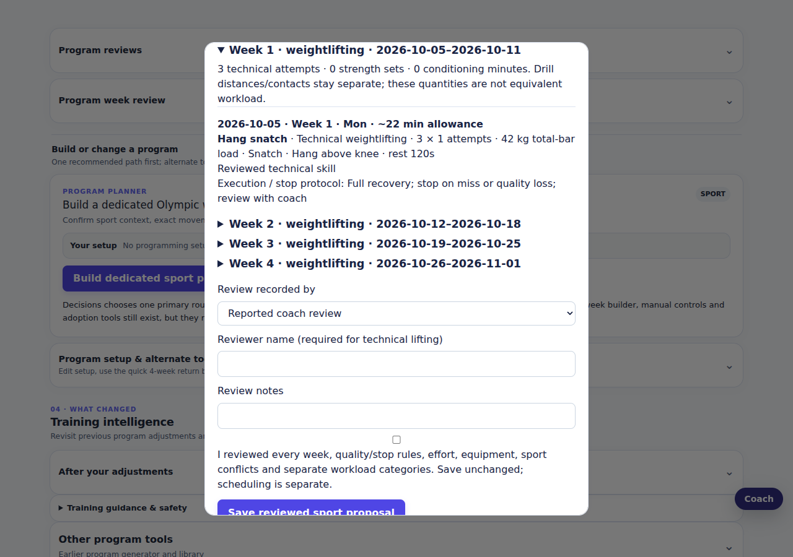
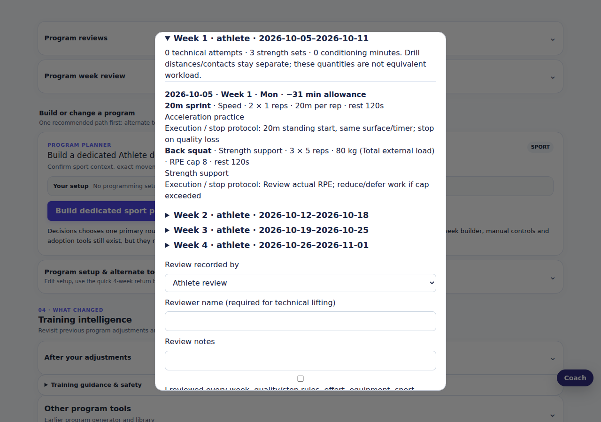
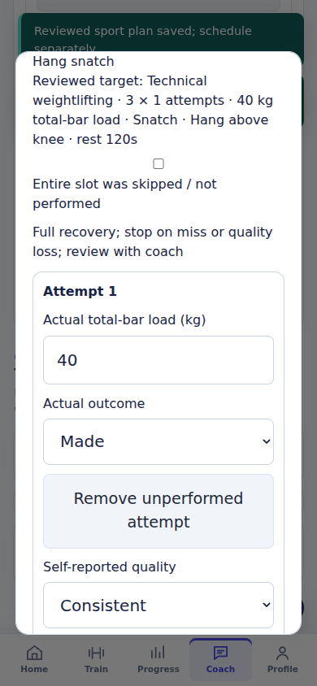

# v2.97 demo and interface audit

Dedicated Olympic weightlifting and athlete planners share the existing Goals, Decisions, Calendar, current-program viewer, Coach and backup/sync architecture. These are reviewed adult development plans, not automatic sport peaking, rehabilitation or youth programs. All screenshots below use synthetic test data, not personal training history.

## Demo walkthrough

1. **Profile / Goals:** confirm sport, primary/secondary training type, season, known practice/game schedule, experience, equipment, available days and session time. Decisions requires confirmed exact exercise identities and training modes; unclear identities stay unavailable.
2. **Coach → Decisions → Build or change a program:** a single matching active sport goal offers its dedicated planner. Both planners remain accessible in the alternate tools. Existing powerlifting and hypertrophy routes remain available.
3. **Olympic planner:** choose an exact technical lift, lift family/variation, explicit total-bar starting load, attempts, rest and a quality/stop protocol. Confirm coaching support. No strength-derived percentage or failure target is inferred.
4. **Athlete planner:** choose strength support, speed, jumping, agility and/or conditioning. Specify each drill's distance/contacts, recovery and execution/measurement protocol. Skill-quality tasks appear before strength and conditioning. Competition days and their preceding days are protected; overlapping practices/restrictions require reported coordination.
5. **Preview every week:** review distinct attempts, strength sets, drill distances/contacts and conditioning minutes. They are not equivalent workload. Optional lower-volume weeks reduce rounds/minutes rather than automatically changing load. Technical lifting requires a named reported coach review; editing input invalidates the old preview.
6. **Save, then schedule:** saving creates a reviewed proposal only. Separate scheduling rejects stale context, open drafts, occupied dates and overlapping reviewed cycles. No existing training is replaced.
7. **Home / current-program viewer / Calendar:** inspect frozen targets and protocols. A sport session opens its dedicated actual recorder; ordinary strength logging cannot silently load technical/drill targets.
8. **Record actual work:** loads/RPE are blank and outcomes/quality unknown until reported. Remove unperformed attempts, explicitly skip entire slots, or add already-performed extra work without increasing future prescriptions. Technical attempts enter Olympic practice; measured drills enter the separate athletic journal. Only actual strength/conditioning enters those workout categories. A linked session log is not proof that every target was completed.
9. **Coach and sport-plan evidence review:** use the same read-only report. Incomplete dose/effort evidence asks for more evidence; misses, inconsistent quality, changed context or effort above the cap ask for coach review. The app does not diagnose technique, estimate drill power, prove sport transfer or automatically progress loads.

## Visual demo

### Olympic review, desktop

### Athlete review, desktop

### Actual Olympic recording, mobile

Additional captures: [Olympic review, mobile](demo-v2.97/olympic-planner-preview-mobile.png), [athlete review, mobile](demo-v2.97/athlete-planner-preview-mobile.png), [actual recorder, desktop](demo-v2.97/olympic-actual-recorder-desktop.png).

## Audit coverage

| Surface | Checks |
|---|---|
| New planners | Named review, context guards, fixed targets, stale previews, reload, separate scheduling, collision prevention |
| Sport execution | Unknown defaults, skipped/partial/extra work, private local drafts, reload recovery, failed-save retry, target/actual isolation |
| Decisions / Coach | Shared evidence, missing effort/dose coverage, cap exceedance, technical outcomes separate from strength PRs |
| Home / Calendar / programs | Lifecycle routing, current-program viewer, next-action controls, existing hypertrophy/powerlifting/meet/adoption flows |
| Train / history / Progress | Logger, gym-floor controls, rest/execution state, units, session edits, timing, revisions, PRs and analytics |
| Remaining interface | Goals/Profile, nutrition, measurements, photo/navigation controls, responsive forms, keyboard/reduced-motion behavior |
| Reliability | Offline/reload, failed persistence, import rejection, backup fingerprints, account/sync conflict handling, older-schema migration |
| Native | Local bundle/source packaging, identity/version/permissions/privacy/plugin checks; not compilation or device acceptance |

The full browser suite runs both 1280×900 desktop and 390×844 mobile Chromium. Existing remote AI/account behavior is mocked by those tests; this is not a live model, provider or cloud end-to-end acceptance test. A separate local-only audit also migrated an older real backup, preserved the original workouts through reload, regenerated a verified export, and visited every navigation surface without publishing private data.

## Fixes made during implementation and audit

- Prevented technical/drill targets from becoming strength sets, estimated maxima, PRs or hypertrophy workload through generic logging/plan comparisons.
- Added explicit skipped/partial work and already-performed extra work while preserving frozen prescriptions and honest evidence gaps.
- Added device-local sport draft recovery and retryable failed saves; applying a plan checks both ordinary and sport drafts.
- Made cycle-conflict guards symmetric across sport and existing program scheduling; non-overlapping future cycles remain possible.
- Kept technical evidence scoped to linked sessions so unrelated goal-level practice is not attributed to a program.
- Included missing actual effort/dose evidence and effort-cap exceedance in the shared Coach report.
- Connected actually performed strength support to existing PR reconciliation, without turning technical attempts or athletic drills into strength PRs.
- Guarded declined service-worker registration so update/focus handlers do not throw in managed browsers.
- Visually checked desktop/mobile planner review and actual-recording dialogs for readable wrapping and horizontal fit.

## Validation and limits

Verification passed: all **135 unit-test files**, all **518 desktop/mobile browser tests** (8.9 minutes), JavaScript syntax, mobile release-bundle checks and unsigned native-source checks. The focused planner/update-handler tests were also rerun after the final UI refinements. The private migration/navigation audit passed on desktop and mobile; its fixture and traces are not included in this repository.

Passing checks cannot prove the absence of every bug. Native compilation/signing, real-device testing, live cloud/AI acceptance and sport-coach validation remain separate. Athletic journal records are revisioned in storage, but a dedicated athletic-observation correction/history interface is not introduced in this release. Reported coaching identities and quality are not independently verified.
