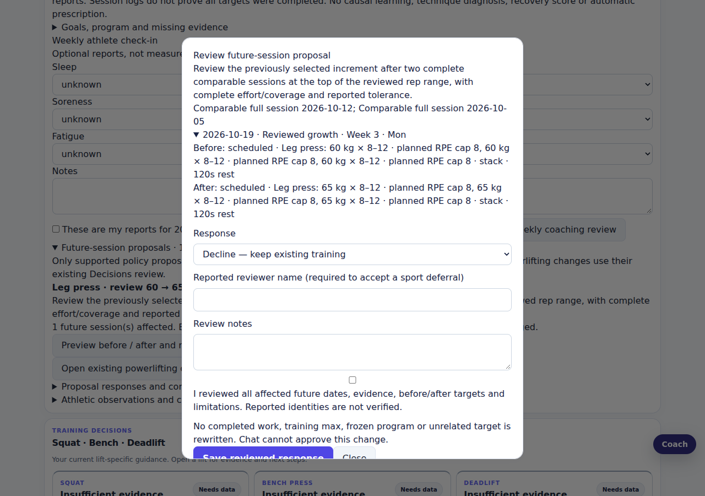
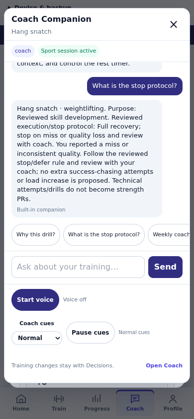

# v2.98 coaching walkthrough

Screenshots use synthetic training records only.

1. Open Coach → Decisions → Shared coaching review. Inspect the current corrected weekly evidence and missing reports; save explicit sleep/soreness/fatigue values, leaving unknowns where appropriate. Training stays unchanged.
2. Open Future-session proposals. With two qualifying complete leg-press sessions, preview the one eligible future increase from 60 to 65 kg. The lower-volume week is excluded. The response defaults to decline. Approval adds a Calendar revision; completed logs and the frozen program remain intact.
3. Start a reviewed Olympic session from Calendar. Report an actual miss, then choose Ask Companion about this sport session → What is the stop protocol? Companion explains the recorded purpose and protocol using the live report. Closing Companion preserves the recorder and draft.
4. Inspect an athletic journal correction. Change only the actual observation; confirmation appends a revision. A failed save retains entered values for retry.

These demonstrations verify browser behavior. They do not establish technique quality, individualized dosing, native-device acceptance or the effect of advice on training results.
