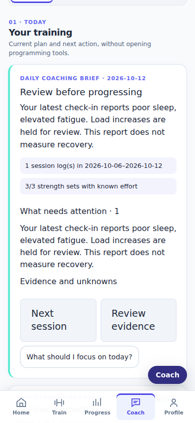
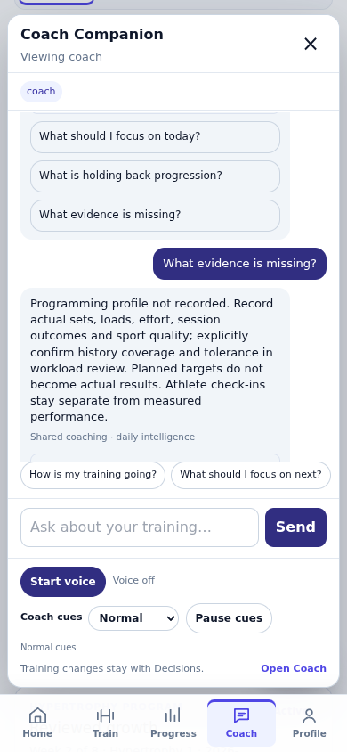
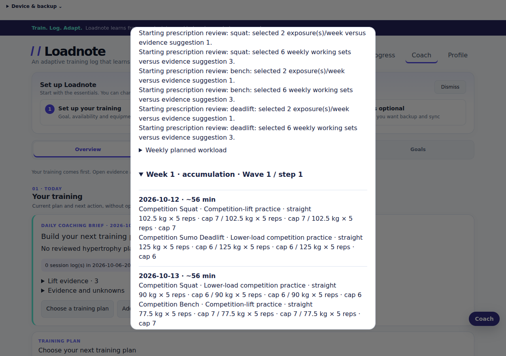
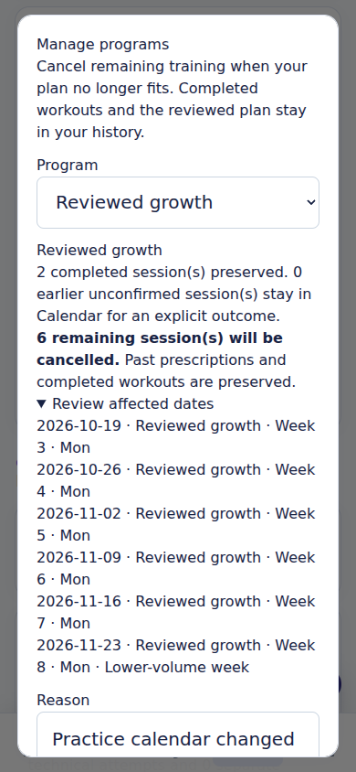
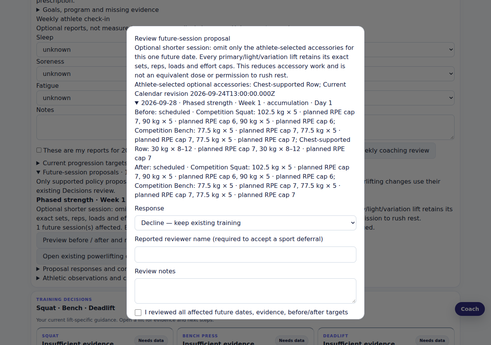

# v3.0 synthetic interface walkthrough

Captured from automated Chromium desktop (1280×900) and mobile (390×844) scenarios. All goals, plans, check-ins and workouts are synthetic fixtures. Images show the running interface, not mockups.

## Daily brief and shared conversation

Open Coach → Decisions. The daily brief separates the current program workflow, recorded sets/effort, per-lift evidence, reported concerns and unknowns. A poor-sleep/elevated-fatigue check-in holds load-increase options for review. Ask “What should I focus on today?” in either Coach or Companion; both use fresh shared records. Follow-up questions never treat earlier assistant claims as evidence. Review buttons open the appropriate workflow without applying training changes.

## Wave loading

Open Programming → Program designer → Periodization → Wave loading. Enter explicit movement training maxes and review every week. Accumulation straight/top sets use 5/4/3 reps; strength straight/top sets use 4/3/2, with +0/+2.5/+5 percentage-point steps inside each wave. The next wave resets reps and adds the selected base step; strength back-offs retain five reps at their lower-load target. Partial waves stop at phase boundaries and deload remains fixed. Saving and scheduling remain separate approvals. Reload verifies the actual frozen prescription.

## Program cancellation and restoration

Open Decisions → Manage programs. Preview the affected dates, give a reason and confirm. The scenario preserves two completed sessions and the frozen plan while cancelling six remaining dates. Reload retains the cancellation journal. Restoration previews its dates and checks the current journal, date validity, schedule revisions, replacement conflicts and open drafts. Storage failures leave in-memory training unchanged.

## Practical shorter sessions

For a supported future phase/meet session within seven days, open Shared coaching review → Future-session proposals. The exact before/after preview omits only athlete-selected optional accessories for one date. Primary/light/variation doses are preserved; the frozen program and completed workouts are unchanged. Approval persists the revised Calendar target through reload. This reduces accessory work and does not promise an equivalent dose or a particular duration.

## Verification coverage

- `tests/v3-coaching.test.js`: waves, partial waves, linear compatibility, immutable plans, cross-domain cancellation, restoration, stale/tampered histories, backup/sync, fresh follow-ups, exact accessory omission and attributed outcomes.
- `tests/browser/v3-coaching.spec.js`: seven scenarios on both viewports covering the real controls, reloads, storage failure, signed-in shared-answer routing and Olympic recorder draft preservation.
- Existing cockpit scenario now asserts no JavaScript exception after target-fill/load-step shortcuts and checks keyboard focus.
- Syntax, all 140 Node test files, mobile bundles and native source checks are release gates. Required CI also runs the complete 552-scenario browser suite and unsigned Android/iOS compilation.

Screenshots were visually inspected. Native compilation, browser simulations and synthetic evidence do not establish physical-device acceptance, licensed instruction quality or improved athlete outcomes.
