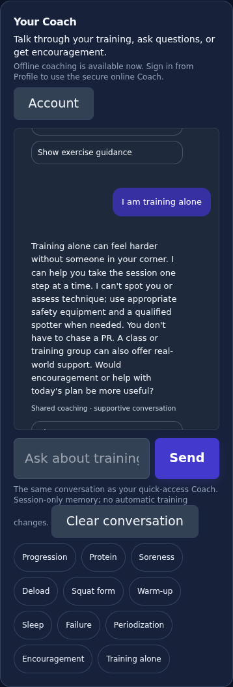
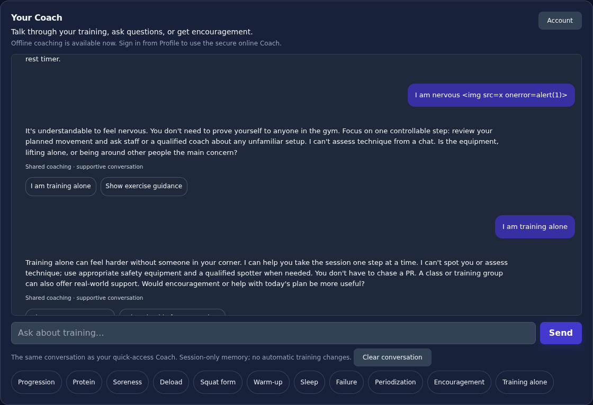

# v3.1 synthetic interface walkthrough

Real Chromium desktop/mobile screenshots, using synthetic reviewed programs and workout data. No uploaded athlete records were used.

## Reviewed time option

Open Decisions → Adapt planned session. Enter the budget, explicitly supply a timing assumption if recorded rest is missing, and choose only reviewed optional accessories. The preview retains primary prescriptions and shows when essential work still exceeds the budget. Confirmation writes one Calendar revision; reload keeps it. Changing inputs removes the previous approval preview.

## Confirmed preferences and alternatives

Training preferences saves equipment, exclusions, time budget and movement mappings only on this device. Confirm both identities and their purpose/group/equipment before viewing alternatives. Excluded movements are filtered. Enter a fresh starting dose in the displayed kg/load convention; no training max or previous result is copied.

## Guidance without leaving the workout

Exercise guidance is one control beside the current workout. The exact-movement card provides educational setup/cues, external instruction and existing athlete notes. Unsupported identities show an explicit fallback rather than borrowing another movement’s technique. Closing guidance leaves actual sets unchanged.

## Verification

- 142 Node test files, including supportive conversation, safety precedence, timing assumptions, fresh doses, invalid numeric input, tampering, stale revisions, protected primary work, Calendar history and sync.
- Eleven new browser scenarios on both viewports: 22 cases cover real controls, preference/mapping persistence, explicit reset, exclusions, missing rest, Olympic protocol protection, open drafts, failed writes, reloads and guidance non-mutation.
- Seven additional desktop/mobile unified-Coach scenarios (14 cases) cover cross-view history, shared clearing, safety, research answers, dark contrast, concurrent requests and voice transcript context. Coach/voice and existing program-review regressions also passed locally. Required CI runs the full 588-case browser suite and unsigned Android/iOS compilation.
- Screenshots are inspected for readability and mobile fit. Synthetic/browser checks do not replace physical-device acceptance or qualified technique review.

This release deliberately limits adaptation to reviewed phase/meet accessories and begins the curated guidance library with three movements; it does not claim full competitor parity, automatic recovery estimation or policy learning.

## One Coach, with encouragement

Ask in Companion, then open the full Coach and continue with a follow-up. Both views use one session-only history and show the same messages. Encouragement and Training alone are explicit quick questions; no mood is inferred from logs. Athlete-reported achievements are acknowledged without inventing verified progress. Pain and crisis language take precedence over pep talks. Online Coach still requires a configured authenticated server; bounded local support works offline.

